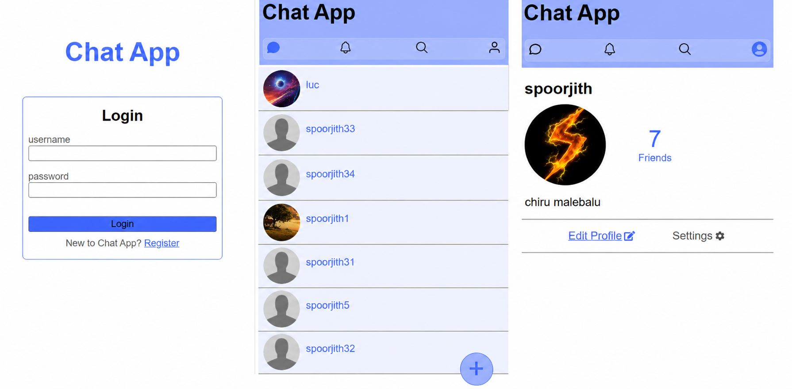
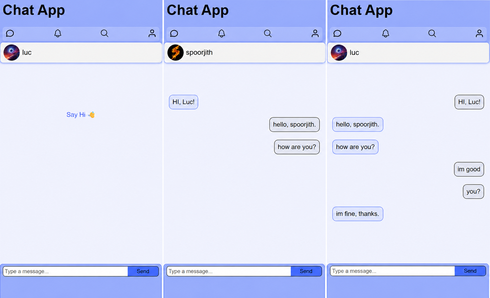
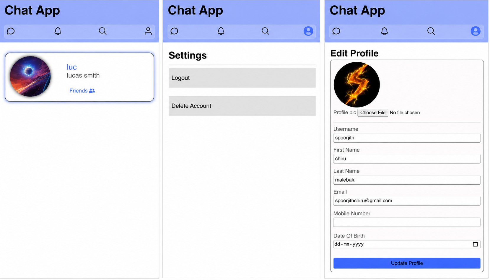
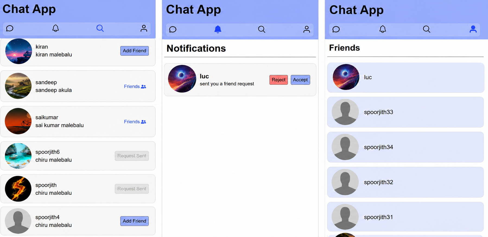

# Private Chat Application

A Full-stack private messaging application built with Django REST Framework and React.js.  

## Description
This project is a full-stack private chat application with one-to-one private messaging. Users can create an account, authenticate using JWT .
The application allows users to send and accept/reject friend requests, private messaging with their friends with secure authentication.  
The backend is developed using Django REST Framework, while the frontend is built with React.js.

>**NOTE :** This project currently uses REST APIs for messaging. Real-time messaging using Django Channels/WebSockets i am planning on adding them soon.

## Features
- User Registration
- JWT Authentication
- User Login & Logout
- View User Profiles
- Edit Profile
- Send Friend Requests
- Accept Friend Requests
- Reject Friend Requests
- Friends List
- One-to-One Private Chat
- View Chat History
- Protected APIs
- Responsive React Frontend

## Screenshots

## Tech Stack

### Backend
- Python
- Django
- Django REST Framework

### Authentication
- JWT Authentication

### Frontend
- React.js
- Axios
- React Router
- CSS

### Database
- PostgreSQL

### Tools
- Git
- GitHub
- VS Code
- Postman API Testing
